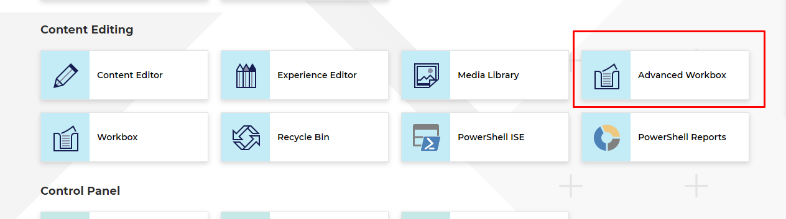
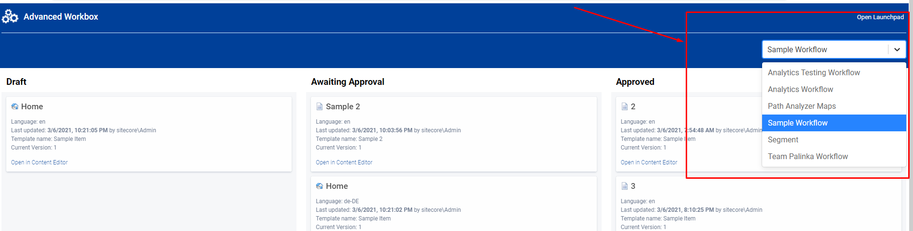
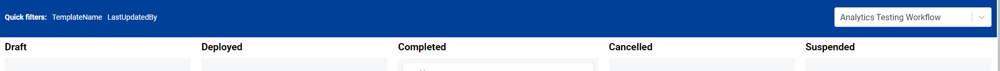
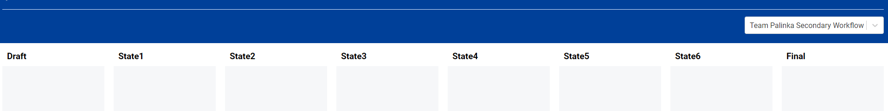
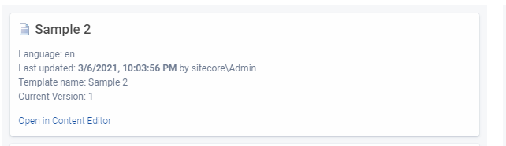
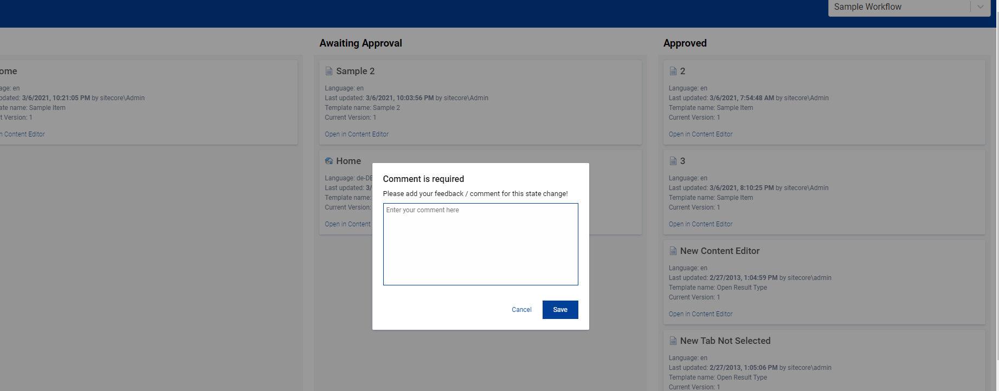

# Hackathon Submission Entry form

## Team name
⟹ Team Palinka - Another shot

## Category
⟹ The best enhancement to the Sitecore Admin (XP) for Content Editors & Marketers

## Description
⟹ Advanced Sitecore Workbox (or Refurbished Workbox)

### Purpose of the module

- The main purpose of this module to have a new and cleaner UI for the workbox
- The new UI provides a better user experience by utilizing drag and drop features.
- The new UI provides more information about the items and about their workflow state/history than the previous one. 

- It helps the content authors to identity easily which items belongs to which workflow state and allows a very easy changes.

## Video link
⟹ Demo Video

⟹ [Replace this Video link](#video-link)

## Pre-requisites and Dependencies

⟹ The submission requires the following softwares on the client machine:

- Docker Desktop on Windows, running in Windows Containers mode
- The module can be used on XM or XP configuration. (Please note, the current solution uses XP)
- No other program is required in order to spin up the container images

## Installation instructions on Docker
⟹ Installation instructions how to spin up the docker image  

**Notes:** You do not have to build Visual Studio solution or the React client applications, everything is done in Docker

**Possible issues around the Docker build**
- The MSBuild might not be able to restore nuget packages
  - Solution: Add "dns":["8.8.8.8"] to the Docker Engine Configuration
    - 
- The CM site shows 404 empty page
  - Solution: You might have to wait a bit more, because the CM container starts a bit slower.

**Installation steps**

- Clone this repository
- Copy a Sitecore Licence into the **.\docker\Licence** folder
- Call the **.\start-hackathon.ps1** script in the repository root in **PowerShell** console with **Administrator** priviliges
- Wait for the containers and wait for the CM site
- Once the https://cm.team-palinka.localhost is loaded, call the following commands in the powershell
- Call **dotnet tool restore** command
- Call **dotnet sitecore login --authority https://id.team-palinka.localhost --cm https://cm.team-palinka.localhost --allow-write true**  command
- A login page will be opened, please login with admin credentials and add access to the API. (Username: admin, password: b)
- Call **dotnet sitecore ser push** command
  - This will push the module related and some sample item into the Sitecore database.
- Open Sitecore Launchpad, navigate to the control panel, and populate **Solr Managed Schema** for all indexes
- Navigate to the control panel, and rebuild every search indexes in the **Indexing Manager**
- Start Advanced Sitecore Workbox on the Launchpad (Find next to the original Workbox Shortcut)

## Installation via Sitecore Package
Provide detailed instructions on how to install the module, and include screenshots where necessary.

- Use the Sitecore Installation wizard to install the [package](sc.package/Advanced.Sitecore.Workbox-v1.0.zip)
- Make sure if your search indexes are working correctly
- Go the LaunchPad and open the Advanced Workbox.

### Configuration
The module does not requires any extra configuration, configuration files are using the proper Server Roles. (Standalone or Content Management) The package contains a configuration patch, which registers the http routes and IoC container, and sets the "Sitecore.Services.SecurityPolicy" to "ServicesOnPolicy" - it is required for the SPA application.

## Usage instructions

The new Workbox application can be easily opened from the Sitecore Launchpad. (The shortcut is located in the **Content Editing** section)

The applications allows you to select between workflows. The Workflow selector is located in the right top corner.

After changing the workflow, the board automatically loaded. Each workflow state is represented as a column. 
If a workflow has 3 different states, 3 columns are displayed. If a workflow has 6 states, 6 columns are displayed.

Every item is displayed in a card. The most relevant information are displayed, such as ItemName, Language, Latest Version Number and Last Updated Date and Last Updated By. 
Besides displaying the information, you can open the item directly in Content Editor in the target language.

The item name is clickable, if you click on it, a detail page opens with other relevant information.

The item card is draggable and you can move items into other state. You can only target columns which are allowed for the current workflow. 

If you drop the card in a new column, you may be prompted to enter a comment. The comment box visibilty depends on the current workflow action "Suppress Comment" checkbox.

**The detail page**

## Comments
The model takes into the consideration security rules and the built in Sitecore Workflow command visiblity evaluation logic.

